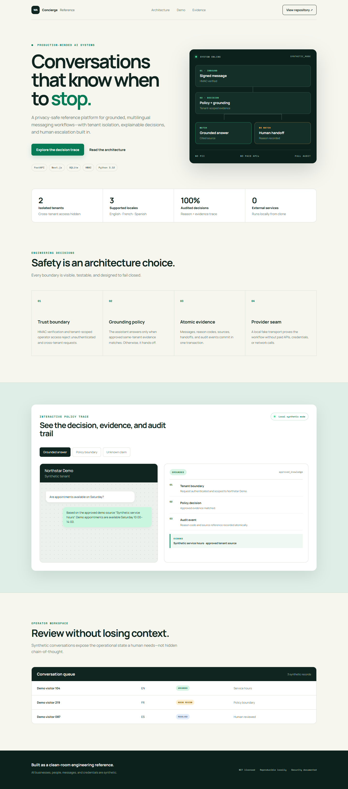
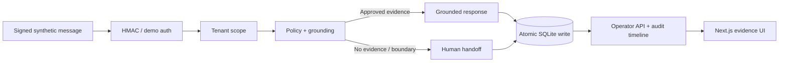

# WhatsApp AI Concierge Platform

> A privacy-safe, tenant-aware reference implementation for grounded messaging, explainable policy decisions, and human escalation.

[](https://github.com/Saliflearning/whatsapp-ai-concierge-platform/actions/workflows/ci.yml)
[](https://github.com/Saliflearning/whatsapp-ai-concierge-platform/actions/workflows/codeql.yml)
[](LICENSE.md)

This project demonstrates the control plane behind a responsible conversational AI workflow. A signed inbound message is authenticated, isolated to one tenant, evaluated against approved evidence, and persisted with a reason-coded audit trail. If evidence is missing—or a request crosses a policy boundary—the automation stops and creates an operator handoff.

Every business, person, message, credential, and knowledge source is synthetic. No private implementation, customer record, paid API, or external messaging account is required.



## Why it matters

Many AI demos optimize for producing an answer. This one also proves when an automated answer must not be produced:

- **Grounded responses:** answers cite an approved, same-tenant source.
- **Safe escalation:** unsupported and sensitive claims become human handoffs.
- **Tenant isolation:** every read, write, event key, and mutation carries tenant scope.
- **Explainable operations:** reason code, evidence reference, handoff state, and audit event stay together.
- **Reproducible evidence:** the entire showcase runs locally with deterministic data and a fake provider.

## Architecture



See [architecture details](docs/architecture.md), the [security model](docs/SECURITY_MODEL.md), and the [decision records](docs/decisions/).

## Technology

| Layer | Choice | Engineering purpose |
|---|---|---|
| API | Python 3.12, FastAPI, Pydantic | Bounded contracts and explicit validation |
| Persistence | SQLite | Transactional, zero-service reproducibility |
| UI | Next.js 16, React 19, TypeScript | Responsive recruiter and operator evidence view |
| Security | HMAC-SHA256, constant-time comparison | Request authenticity and scoped demo access |
| Quality | pytest, Ruff, MyPy, Vitest, ESLint | Behavioral, security, type, and presentation gates |
| Delivery | Docker Compose, GitHub Actions, CodeQL | Reproducible build and continuous verification |

## Quickstart

### Docker Compose

```bash
docker compose up --build
```

Open `http://localhost:3000` for the showcase and `http://localhost:8000/docs` for the API contract. Compose uses obvious local synthetic credentials only.

### Native development

Backend (Python 3.12):

```bash
python -m venv .venv
.venv/Scripts/python -m pip install -r backend/requirements-dev.txt
cd backend
../.venv/Scripts/python -m uvicorn app.main:create_app --factory --reload
```

Copy `.env.example` to `.env` and load those variables before starting the API. On macOS/Linux, use `.venv/bin/python`.

Frontend (Node 22):

```bash
cd frontend
npm ci
npm run dev
```

## Demonstrated journeys

1. **Approved answer:** “Are appointments available on Saturday?” matches the synthetic service-hours source and returns a citation.
2. **Policy boundary:** “Is this a safe neighborhood?” creates a human handoff instead of characterizing an area.
3. **Insufficient evidence:** an unverified timeline or promise is declined and audited.
4. **Operator resolution:** a tenant-authorized operator reviews and resolves the handoff idempotently.
5. **Duplicate delivery:** the same provider event returns the original result without duplicate messages or sends.

## Verification

```bash
# Backend
cd backend
../.venv/Scripts/python -m pytest --cov=app
../.venv/Scripts/ruff check .
../.venv/Scripts/mypy app

# Frontend
cd ../frontend
npm test
npm run lint
npm run typecheck
npm run build
npm audit

# Public-release safety
cd ..
.venv/Scripts/python scripts/scan_public_safety.py
.venv/Scripts/python scripts/scan_public_safety.py --history
```

The exact release evidence is recorded in [Portfolio Readiness](docs/PORTFOLIO_READINESS.md).

## Honest boundaries

This is a reference implementation, not a hosted production messaging service. It deliberately uses SQLite, deterministic keyword grounding, local demo tokens, and a fake transport. Production evolution would add managed identity, encrypted multi-node storage, rate limiting, provider-approved templates, observability, retention controls, and operational review—not silently claim those capabilities here.

## License and security

MIT licensed. See [LICENSE.md](LICENSE.md). Report vulnerabilities through GitHub private vulnerability reporting as described in [SECURITY.md](SECURITY.md).
