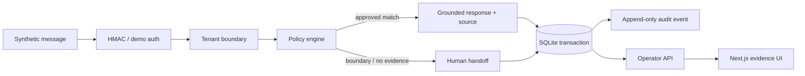

# Architecture

The API is a hexagonal reference: domain and policy code depend on interfaces, not messaging vendors. A local transport adapter demonstrates delivery without external services. SQLite is intentionally scoped to a reproducible single-node demo; the repository boundary can be replaced with a production datastore without changing policy behavior.

Inbound provider events are unique within a tenant. Persistence uses an immediate transaction so duplicate delivery cannot create duplicate messages or handoffs. Every query and mutation carries the tenant key, and cross-tenant misses return `404` to avoid revealing record existence.
